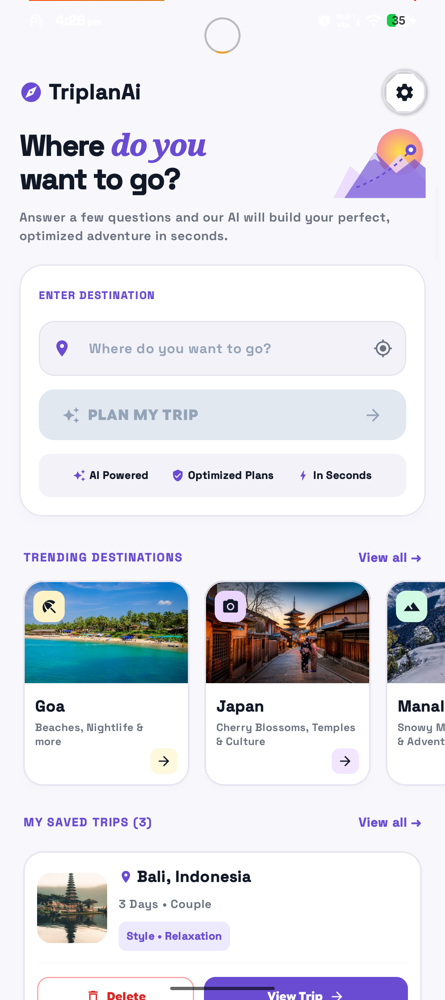
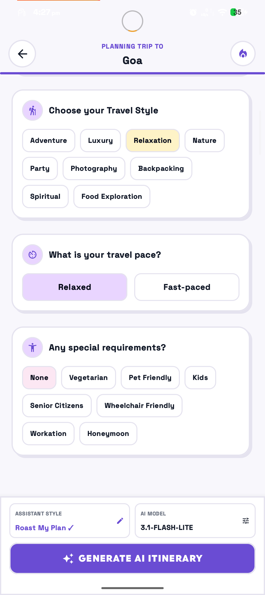
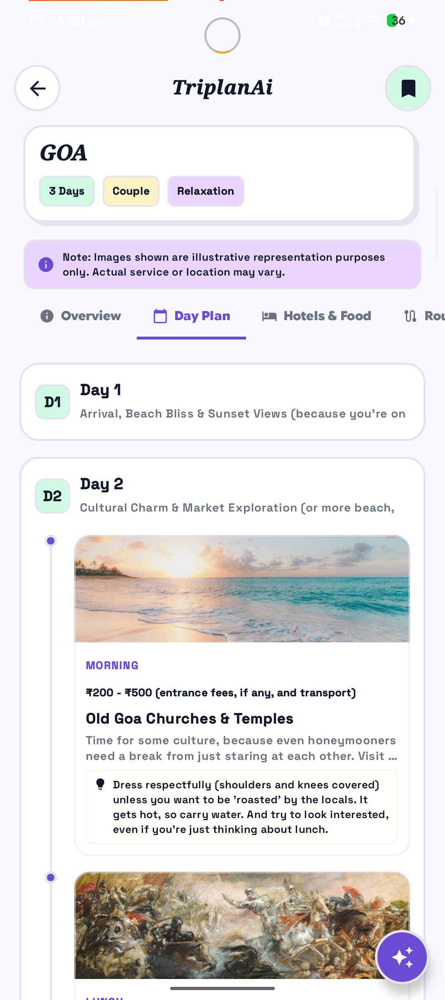
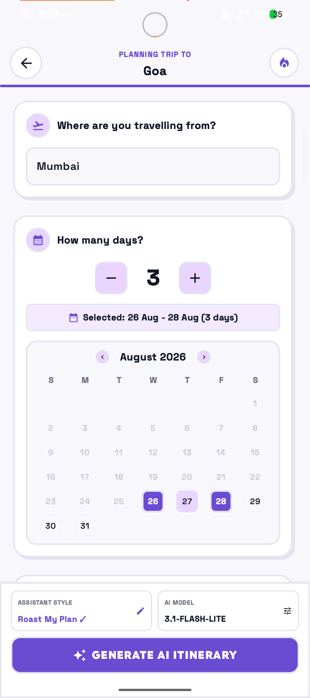
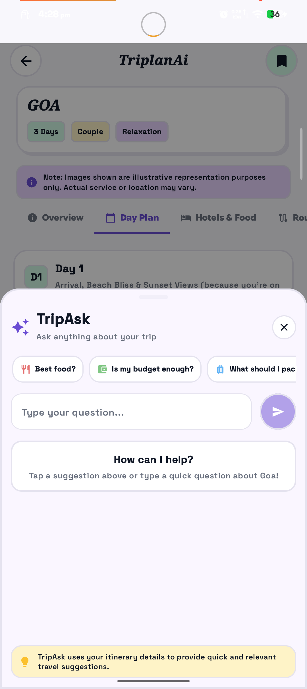
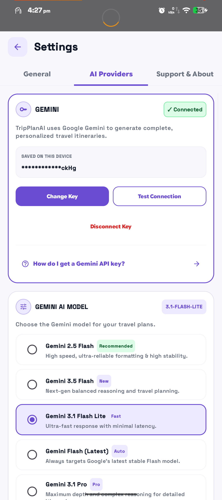
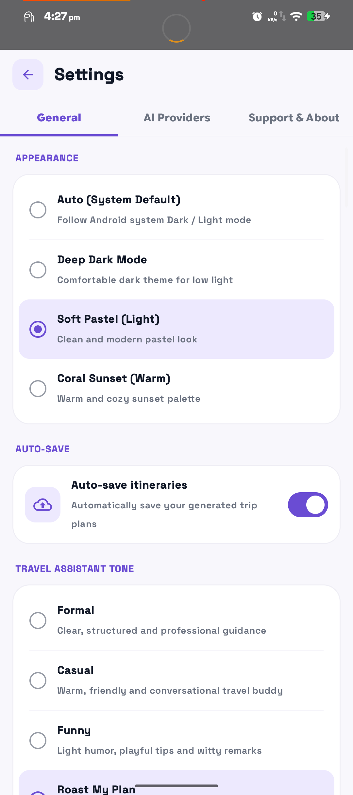
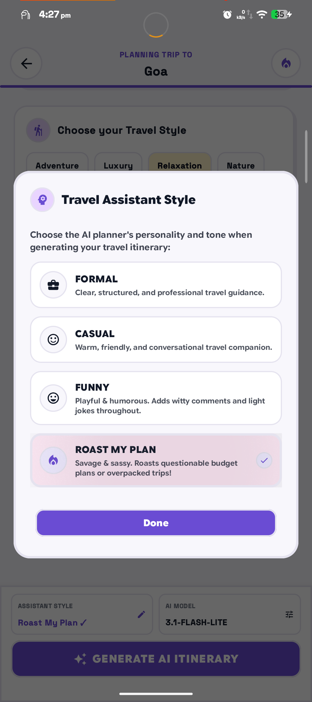
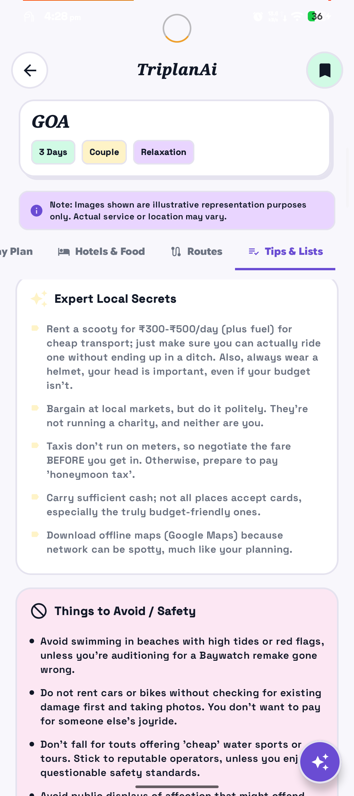

<div align="center">

<!-- Replace this src with your logo -->


# TriplanAI

### Plan less. Explore more.

AI-powered travel planning that turns your destination, preferences, budget, and travel style into a structured trip itinerary.

<br>


<br><br>





</div>

---

## About App -

**TriplanAI** is an Android travel planning app that uses AI to transform a simple destination idea into a personalized itinerary.

Choose your destination, trip duration, budget, travel style, transportation, and traveller preferences — TriplanAI generates a structured plan designed around your trip.

Instead of jumping between multiple apps to figure out what to do, where to stay, how much to spend, and how to organize each day, TriplanAI brings the planning process into one experience.

---

## ✨ Features

### 🤖 AI Itinerary Generation

Generate personalized travel itineraries using **Google Gemini**.

The generated plan can include:

- Day-by-day activities
- Places to visit
- Food suggestions
- Transportation
- Estimated costs
- Timing suggestions
- Travel notes

### 💰 Budget Planning

Plan trips around your preferred spending level:

- Budget Friendly
- Mid Range
- Luxury

The itinerary can provide estimated costs for accommodation, food, transportation, activities, and other expenses.

### 🗓️ Structured Day Plans

Trips are organized into individual days so the itinerary is easier to understand and follow.

### 🏨 Stay & Food Recommendations

Get AI-generated suggestions for accommodation and food based on your destination and preferences.

### 🧭 Route Planning

View simplified transportation and route information for your generated trip.

### 💾 Saved Trips

Save generated itineraries locally and access them later without regenerating the entire trip.

### 💬 TripAsk

A lightweight AI assistant designed specifically for the currently generated trip.

Ask things like:

> What should I pack?

> Is Day 2 too hectic?

> How can I save money?

> What food should I try?

TripAsk uses **Groq + gpt-oss-120b** for fast contextual responses.

---

## 🧠 AI Architecture

TriplanAI separates its AI workloads instead of using one model for everything.

```text
                  TriplanAI
                      │
          ┌───────────┴───────────┐
          │                       │
          ▼                       ▼
    Google Gemini              Groq
          │                       │
          ▼                       ▼
 Full Trip Planning        TripAsk Assistant
          │                       │
          ▼                       ▼
   Complete Itinerary      Quick Contextual
                           Travel Answers
````

### Google Gemini

Used for the main travel-planning experience:

* Itinerary generation
* Budget planning
* Daily activities
* Travel recommendations
* Route context

### Groq + gpt-oss-120b

Used for:

* TripAsk
* Short travel questions
* Contextual assistance
* Fast responses

---

## 📱 Screenshots

<div align="center">

<table>
<tr>
<td align="center">

<br>
<b>Home</b>
</td>

<td align="center">

<br>
<b>Trip Planning</b>
</td>

<td align="center">

<br>
<b>Generated Trip</b>
</td>
</tr>

<tr>
<td align="center">

<br>
<b>Planning Options</b>
</td>

<td align="center">

<br>
<b>TripAsk</b>
</td>

<td align="center">

<br>
<b>Settings</b>
</td>
</tr>

<tr>
<td align="center">

<br>
<b>Settings & AI</b>
</td>

<td align="center">

<br>
<b>AI Tone</b>
</td>

<td align="center">

<br>
<b>Trip Details</b>
</td>
</tr>

</table>

</div>

## 🛠️ Built With

| Technology                 | Purpose                   |
| -------------------------- | ------------------------- |
| **Kotlin**                 | Android development       |
| **Jetpack Compose**        | UI                        |
| **Google Gemini**          | Main itinerary generation |
| **Groq**                   | TripAsk AI                |
| **gpt-oss-120b**           | TripAsk model             |
| **Firebase Remote Config** | Remote app configuration  |
| **Room / Local Storage**   | Saved trips & local data  |
| **GitHub**                 | Source control            |

---

## 🔐 API Keys

TriplanAI is designed so API credentials should **not be hardcoded into the application source code**.

Never commit private API keys to GitHub.

For development, configure your API credentials through the appropriate local configuration/environment mechanism.

---

## 📥 Download

<div align="center">

<a href="https://github.com/Ishaanj2007/triplanai-app/releases">


</a>

<br><br>

Download the latest APK from the **Releases** page and install it on your Android device.

<br>

<a href="https://github.com/Ishaanj2007/triplanai-app/releases">
<b>→ View Latest Release</b>
</a>

</div>

## 📱 Application Flow

```text
Destination
     ↓
Trip Preferences
     ↓
Duration & Budget
     ↓
Traveller Type
     ↓
Transportation
     ↓
Generate
     ↓
AI Itinerary
     ↓
┌─────────┬─────────┬─────────┬─────────┐
│Overview │Day Plan │  Stay   │ Routes  │
└─────────┴─────────┴─────────┴─────────┘
     ↓
   TripAsk
     ↓
  Save Trip
```

---


## 📌 Project Status

**Current Version: `2.2.0`**

TriplanAI is an actively developed personal Android project.

The application is continuously evolving with improvements to:

* AI generation
* UI/UX
* Travel planning
* TripAsk
* Saved trips
* Remote configuration
* Reliability

---

## 👨‍💻 Developer

<div align="center">

### Ishaan Jadhav

Independent developer & creator of **TriplanAI**

<br>

<a href="https://github.com/Ishaanj2007">

</a>

<a href="https://instagram.com/ishaanj_19">

</a>

</div>

---

## ☕ Support the Developer

<div align="center">

### Enjoying TriplanAI?

TriplanAI is an independent project built and maintained with a lot of experimentation, time, and caffeine.

If you find it useful and want to support continued development, you can send a small contribution.

<br>

</a>

<a href="upi://pay?pa=jadhavishaan64@okaxis&pn=Ishaan%20Jadhav&cu=INR">
  
</a>

Every bit of support helps with:

AI usage • Development • Testing • Infrastructure • New features

</div>

---

## 📄 License

This project is licensed under the **MIT License**.

See [`LICENSE`](LICENSE) for details.

---

<div align="center">

### TriplanAI

**Plan less. Explore more.**

Built with curiosity & code.

⭐ If you like the project, consider giving it a star.

</div>


